# FlyAsh Intel

**AI-Driven Intelligent Benchmark Dataset and Adaptive Optimization Framework for Sustainable Fly Ash Brick Manufacturing**

An academic research platform designed to transform fragmented fly ash brick literature into a standardized benchmark corpus, support multi-target predictive quality analysis, and formulate constrained manufacturing mix recommendations.

---

## Project Overview

In sustainable civil engineering and masonry manufacturing, pulverized coal fly ash serves as a critical industrial byproduct substitute for clay topsoil and carbon-intensive Portland cement. However, broad industrial adoption is hindered by significant challenges:

- **Raw-Material Variability**: Fly ash characteristics (chemical composition, amorphous reactive silica, unburnt carbon loss-on-ignition, fineness) vary widely depending on coal sources and thermal power plant combustion conditions.
- **Fragmented Literature**: Experimental findings on fly ash-lime-gypsum (FaL-G) and hybrid alkali-activated formulations are scattered across hundreds of independent academic publications with disparate batch reporting units (dry weight fractions, mass per volume, water-to-binder ratios).
- **Trial-and-Error Mix Design**: Brick manufacturers typically rely on ad-hoc, empirical proportioning, resulting in variable 28-day compressive strengths and high water absorption rates that risk structural non-conformance under building codes.

**FlyAsh Intel** addresses these challenges by developing an end-to-end computational pipeline: extracting empirical research data, standardizing it into a canonical benchmark dataset, training multi-output machine learning models to forecast physical performance, and applying multi-objective evolutionary optimization to recommend factory-viable batching recipes.

---

## Research Motivation

Traditional fired clay brick production depletes millions of tonnes of fertile agricultural topsoil annually and consumes vast amounts of fossil fuel in kilns, emitting substantial greenhouse gases and particulate matter. While fly ash bricks offer a zero-clinker or low-carbon alternative, manufacturers face persistent quality control hurdles:

1. **Inconsistent Raw Materials**: Variations between Class F and Class C pozzolans alter ambient hydration kinetics.
2. **Data Sparsity & Inconsistency**: Lack of an open, standardized benchmark dataset hampers rigorous data-driven modeling.
3. **Multi-Objective Trade-Offs**: Maximizing industrial waste utilization often conflicts with early handling strength and water impermeability limits.

This platform bridges materials informatics and software engineering to provide actionable decision support for sustainable masonry production.

---

## Core Objectives

In accordance with the approved research project synopsis, the core objectives are:

1. **AI-Assisted Data Extraction & Standardization**: Develop an intelligent ingestion pipeline that extracts experimental mix designs, chemical compositions, and mechanical test results from unstructured academic papers and normalizes them under canonical units.
2. **Unified Benchmark Dataset**: Curate, validate, and version-control an open-access experimental benchmark corpus adhering to Indian Standards (IS 12894:2002 and IS 3812 Part 1) and ASTM guidelines.
3. **Adaptive Surrogate Modeling**: Develop and evaluate multi-target machine learning regressors to forecast 28-day compressive strength and 24-hour water absorption directly from raw batch proportions.
4. **Manufacturing Mix Optimization**: Formulate constrained Pareto optimization algorithms that synthesize cost-effective, code-conforming batch sheets maximizing fly ash utilization for factory pan mixers.

---

## System Architecture

```mermaid
flowchart TD
    subgraph ResearchPipeline ["Empirical Research Pipeline"]
        A[Published Academic Papers] --> B[01 Literature Extraction Engine]
        B --> C[Data Standardization & Validation]
        C --> D[02 Canonical Benchmark Dataset]
        D --> E[03 Adaptive AI Prediction Engine]
        E --> F[04 Manufacturing Mix Optimizer]
        F --> G[Plant Batch Prescription & Decision Support]
    end

    subgraph SoftwareArchitecture ["Software Implementation Architecture"]
        UI[Frontend UI / Workstation Suite<br><i>React 19 + TypeScript + Vite</i>]
        SVC[Service Abstraction Layer<br><i>src/lib/api/services.ts</i>]
        API[API Layer<br><i>FastAPI / REST Endpoints</i>]
        BE[Python Backend Engine<br><i>Planned ML & Optimization Modules</i>]

        UI --> SVC
        SVC -.->|Development / Demo| MOCK[(Centralized Demo Data<br>src/data/demo/)]
        SVC -->|Production Mode| API
        API --> BE
    end
```



> **Implementation Note**: The frontend interface and interactive workstations are fully developed in this repository. The Python backend services, OCR table detection models, and machine learning training pipelines are planned for subsequent phases.

---

## Platform Modules

### 01. Literature Data Extraction Engine
- **Purpose**: Ingests unstructured academic PDFs, identifies experimental tabular bounding boxes, extracts constituent numerical cells, and maps heterogeneous author terminology into standardized notation.
- **Key Concepts**: Spatial layout heuristics, OCR cell tokenization, dry mass unit normalization ($g/\text{batch}$, $\text{wt}\%$, $\text{kg}/\text{m}^3 \rightarrow \text{dry mass } \%$).

### 02. Benchmark Dataset & Validator
- **Purpose**: Curates and maintains a standardized, open-access experimental dataset with strict stoichiometric validation.
- **Key Concepts**: 100% mass balance verification ($\sum \text{constituents} = 100.0\% \pm 0.1\%$), outlier detection, dual-view explorer (canonical table vs interactive scatter plot), and CSV export.

### 03. Adaptive AI Quality Prediction Workbench
- **Purpose**: Provides real-time surrogate inference predicting 28-day Compressive Strength ($\text{MPa}$) and 24-hour Water Absorption ($\%$) from raw batch inputs.
- **Key Concepts**: Stoichiometric slider formulation, water-to-binder ratio sensitivity, hydration kinetics curves across curing ages (3d, 7d, 14d, 28d), and building code classification.

### 04. Manufacturing Mix Optimizer Workstation
- **Purpose**: Solves multi-objective trade-offs between fly ash replacement ratio, cement clinker minimization, cost, and structural resistance.
- **Key Concepts**: Interactive Pareto convergence frontier visualization, candidate formulation ranking, and production pan mixer batch sheets (prescribing kg per 500 modular bricks).

---

## Current Implementation Status

The table below honestly reflects what is currently implemented in this repository versus components planned for future development:

| Module / Component | Frontend UI | Backend / ML Core | Current Status |
|---|---|---|---|
| **Public Platform & Overview** | Complete | N/A | Available |
| **01. Literature Extraction** | Interactive Workspace | Planned (Python/LayoutLM) | Prototype (Simulated) |
| **02. Benchmark Dataset** | Complete (Table + Scatter) | Planned (PostgreSQL/API) | Available (Curated Demo Corpus) |
| **03. AI Quality Prediction** | Interactive Laboratory UI | Planned (Scikit-Learn/PyTorch) | Prototype (Heuristic Surrogate) |
| **04. Manufacturing Mix Optimizer** | Interactive Workstation | Planned (NSGA-II/DEAP) | Prototype (Pareto Frontier Simulation) |
| **Model Explainability (SHAP)** | API Contract Ready | Planned (TreeSHAP/KernelSHAP) | Architectural Interface Ready |
| **Theme System (Light/Dark)** | Complete | N/A | Available |
| **API Client Service Abstraction** | Complete (`src/lib/api/`) | Planned (FastAPI Backend) | Available (`VITE_USE_MOCK_API`) |

---

## Technology Stack

### Frontend Foundation
- **Framework**: React 19 (React 19.2.8)
- **Language**: TypeScript (TypeScript 6.0 / strict configuration)
- **Bundler & Dev Server**: Vite (Vite 8.2.2)
- **Routing**: React Router DOM (v7.18.3)
- **Icons**: Lucide React (v1.41.0)
- **Linter**: Oxlint (v1.79.0)
- **Styling**: Vanilla CSS Design Token System with CSS Custom Properties (zero heavy CSS framework bloat, highly optimized rendering)

### Planned Backend & Machine Learning Stack
- **API Framework**: Python 3.11+ / FastAPI
- **Data Engineering**: Pandas, NumPy, Pydantic v2
- **Document Extraction**: PDFPlumber, OpenCV, Tesseract OCR / LayoutLM
- **Machine Learning**: Scikit-learn, XGBoost, PyTorch
- **Optimization**: DEAP (Distributed Evolutionary Algorithms in Python), SciPy, Optuna
- **Model Explainability**: SHAP (SHapley Additive exPlanations)

---

## Project Structure

```text
flyash-brick-ai/
├── public/                     # Static web assets and icons
├── src/
│   ├── assets/                 # SVGs and branding media
│   ├── components/
│   │   ├── common/             # Reusable UI (Button, GlassPanel, Stepper, State Indicators)
│   │   ├── dataset/            # Dataset table and SVG ScatterPlotVisualizer
│   │   ├── hero/               # Hero section & InteractivePipeline visualizer
│   │   ├── layout/             # Navbar, Footer, AppShell workstation wrapper
│   │   ├── modules/            # Two-pillar editorial architecture section
│   │   ├── optimization/       # ParetoConvergenceVisualizer and batch views
│   │   ├── prediction/         # Prediction preview and kinetics components
│   │   └── scroll-story/       # 7-stage editorial storytelling pipeline
│   ├── context/                # ThemeContext (Light / System / Dark)
│   ├── data/
│   │   └── demo/               # Centralized demo datasets (papers, dataset, optimization)
│   ├── layouts/                # PublicLayout and WorkstationLayout wrappers
│   ├── lib/
│   │   └── api/                # API types, HTTP client, and modular service layer
│   ├── pages/                  # Page route components
│   ├── types/                  # Core TypeScript domain models
│   ├── App.tsx                 # Root application routing and providers
│   ├── index.css               # Design tokens, accessibility, and theme variables
│   └── main.tsx                # Application entry point
├── .env.example                # Environment variable configuration template
├── .gitignore                  # Comprehensive version control ignore rules
├── CHANGELOG.md                # Project version history
├── CONTRIBUTING.md             # Developer workflow and guidelines
├── LICENSE                     # MIT License source code notice
├── package.json                # Project dependencies and npm scripts
├── tsconfig.json               # TypeScript project configuration
└── vite.config.ts              # Vite configuration
```

---

## Getting Started

### Prerequisites
- Node.js (version 18.0 or higher recommended)
- npm (version 9.0 or higher)

### 1. Clone the Repository
```bash
git clone https://github.com/SwayamMandhani06/flyash-brick-ai.git
cd flyash-brick-ai
```

### 2. Install Dependencies
```bash
npm install
```

### 3. Environment Setup
Copy the template configuration:
```bash
cp .env.example .env.local
```
*(By default, `VITE_USE_MOCK_API=true` is enabled, permitting standalone execution without a local Python server.)*

### 4. Start Local Development Server
```bash
npm run dev
```
Open your browser and navigate to `http://localhost:5173`.

### 5. Build for Production
```bash
npm run build
```
Compiles TypeScript types and builds optimized static assets to the `dist/` directory.

### 6. Preview Production Build
```bash
npm run preview
```

---

## Environment Variables

The application can be configured through environment variables:

| Variable | Default Value | Description |
|---|---|---|
| `VITE_API_BASE_URL` | `http://localhost:8000` | Base URL for the future Python backend API endpoints |
| `VITE_USE_MOCK_API` | `true` | When `true`, services return client-side simulated data. Set to `false` when connecting to live backend |
| `VITE_APP_ENV` | `development` | Environment mode (`development`, `production`, `test`) |
| `VITE_BENCHMARK_SCHEMA_VERSION` | `v0.1.0-canonical` | Canonical benchmark schema version tag |

---

## Demo Data Notice

Current frontend interactive features utilize curated mock data stored in `src/data/demo/`:

- `papers.ts`: Empirical research paper metadata representing published literature.
- `dataset.ts`: 18 standardized formulation records derived from published experiments.
- `optimization.ts`: Illustrative candidate vectors and non-dominated Pareto solutions.
- `predictions.ts`: Computational heuristics simulating multi-target surrogate responses.

These values demonstrate user experience and data flow. They **must not** be interpreted as completed experimental findings or verified published model metrics.

---

## Research Methodology

The complete methodological workflow bridges literature extraction to manufacturing decision support:

```text
Literature Sourcing (PDFs)
       ↓
Bounding-Box Table Detection & Heuristic OCR
       ↓
Constituent Token Extraction & Column Mapping
       ↓
Unit Standardization to Dry Solid Mass %
       ↓
Stoichiometric Validation (100% Mass Balance & Outlier Filtering)
       ↓
Standardized Benchmark Corpus (IS 12894 / IS 3812 Conformance)
       ↓
Multi-Target Surrogate ML Modeling (Compressive Strength & Water Absorption)
       ↓
Constrained Multi-Objective Pareto Optimization (NSGA-II)
       ↓
Factory Pan Mixer Batching Prescription
```

---

## Machine Learning Direction

The planned analytical core encompasses:

- **Model Families**:
  - Random Forest Regression (non-linear baseline and feature interaction)
  - Gradient Boosted Decision Trees (XGBoost / LightGBM)
  - Artificial Neural Networks (Multi-Layer Perceptron for continuous response mapping)
- **Target Variables**:
  1. $y_1$: 28-day Compressive Strength ($\text{MPa}$)
  2. $y_2$: 24-hour Cold Water Absorption ($\%$ by mass)
- **Target Evaluation Metrics**:
  - Root Mean Squared Error ($\text{RMSE}$)
  - Mean Absolute Error ($\text{MAE}$)
  - Coefficient of Determination ($R^2$)
  - 10-Fold Cross-Validation
- **Interpretability Framework**:
  - SHAP (SHapley Additive exPlanations) for global constituent importance and local sample attributions.
- **Optimization Algorithms**:
  - Non-Dominated Sorting Genetic Algorithm II (NSGA-II)
  - Bayesian Optimization using Gaussian Process surrogates

---

## Benchmark Dataset Schema

The standardized benchmark dataset schema includes the following primary fields:

| Field Name | Data Type | Units / Format | Description |
|---|---|---|---|
| `paperId` | String | DOI / Citation | Unique identifier of source research publication |
| `mixId` | String | Alphanumeric | Batch formulation identifier |
| `authors` | String | Author List | Primary researchers who conducted the experiment |
| `year` | Integer | YYYY | Year of publication |
| `flyAshPercent` | Float | % by dry mass | Pulverized fuel ash fraction (Class F / Class C) |
| `cementPercent` | Float | % by dry mass | Ordinary Portland Cement (OPC) additive |
| `limePercent` | Float | % by dry mass | Hydrated lime ($\text{Ca(OH)}_2$) or quicklime activator |
| `gypsumPercent` | Float | % by dry mass | Phospho-gypsum / mineral gypsum sulfate activator |
| `sandPercent` | Float | % by dry mass | River sand / fine aggregate filler |
| `quarryDustPercent` | Float | % by dry mass | Crushed stone dust secondary aggregate |
| `waterBinderRatio` | Float | Dimensionless | Total water to solid binder ratio ($W/B$) |
| `curingDays` | Integer | Days | Curing duration prior to mechanical testing (7, 14, 28) |
| `curingType` | String | Water / Steam / Ambient | Curing environmental regimen |
| `compressiveStrength` | Float | $\text{MPa}$ | Crushing resistance under IS 3495 (Part 1) |
| `waterAbsorption` | Float | % by dry mass | 24-hour water absorption under IS 3495 (Part 2) |
| `is12894Class` | String | Class Designation | Masonry classification (Class 7.5 to Class 25) |

---

## Research References

1. **Kumar, S., & Prasad, J.** (2021). *Experimental Investigation on Pozzolanic Reactivity of Class F Fly Ash-Lime-Gypsum Bricks*. Construction and Building Materials. [DOI: 10.1016/j.conbuildmat.2021.124501](https://doi.org/10.1016/j.conbuildmat.2021.124501)
2. **Shaikh, F. U. A., et al.** (2019). *Mechanical and Durability Properties of High Volume Fly Ash Bricks with OPC Additives*. Materials and Structures (RILEM). [DOI: 10.1016/j.conbuildmat.2019.04.112](https://doi.org/10.1016/j.conbuildmat.2019.04.112)
3. **Turgut, P., & Algin, H. M.** (2020). *Steam-Cured Fly Ash-Quarry Dust Bricks for High-Strength Masonry Units*. ASCE Journal of Materials in Civil Engineering. [DOI: 10.1061/(ASCE)MT.1943-5533.0003011](https://doi.org/10.1061/(ASCE)MT.1943-5533.0003011)
4. **Bureau of Indian Standards**. *IS 12894:2002 — Pulverized Fuel Ash-Lime Bricks — Specification*.
5. **Bureau of Indian Standards**. *IS 3812 (Part 1):2013 — Pulverized Fuel Ash — Specification for Use as Pozzolana in Cement, Cement Mortar and Concrete*.
6. **Bureau of Indian Standards**. *IS 3495 (Parts 1 to 4):2019 — Methods of Tests of Burnt Clay Building Bricks*.
7. **ASTM International**. *ASTM C618 — Standard Specification for Coal Fly Ash and Raw or Calcined Natural Pozzolan for Use in Concrete*.

---

## Academic Context & Sustainability Alignment

This project is conducted as an academic capstone initiative within the **Department of Computer Engineering**, bridging computational computer science (applied machine learning, heuristic extraction, evolutionary multi-objective optimization) with sustainable civil engineering materials.

### United Nations Sustainable Development Goals (SDG) Alignment:
- **SDG 9: Industry, Innovation and Infrastructure** — Fostering resource-efficient industrial manufacturing through data-driven computational optimization.
- **SDG 12: Responsible Consumption and Production** — Promoting substantial reduction of topsoil consumption and carbon emissions by maximizing thermal power plant fly ash recycling in construction materials.

---

## Project Team

- **Academic Program**: Bachelor of Technology (B.Tech) in Computer Engineering
- **Domain**: Applied Machine Learning, Materials Informatics, Sustainable Computing
- **Repository Maintainer**: [Swayam Mandhani](https://github.com/SwayamMandhani06)

---

## License

The source code of this software platform is licensed under the [MIT License](LICENSE).

> **Important Notice on Research Material & Third-Party Literature**:  
> The MIT License applies exclusively to the software source code contained in this repository. Academic research papers, publishers' copyrighted articles, citation abstracts, and any future literature-derived benchmark records remain the intellectual property of their respective authors and publishers, and may be subject to separate copyright, academic fair-use, or open-access licensing terms.
